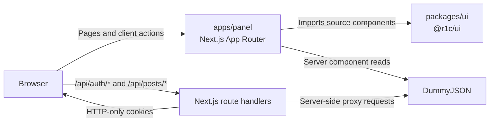
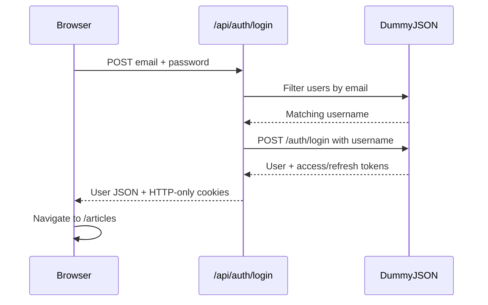

# Architecture

## Overview

The repository is an npm-workspace monorepo coordinated by Turborepo.

## Technology stack

| Layer                     | Technology                                            |
| ------------------------- | ----------------------------------------------------- |
| Monorepo                  | npm workspaces and Turborepo 2                        |
| Application framework     | Next.js 16 App Router                                 |
| UI runtime                | React 19                                              |
| Language                  | TypeScript 5 with strict mode                         |
| Shared icons              | Lucide React                                          |
| Styling                   | Co-located plain CSS and shared CSS custom properties |
| CSS tooling still present | Tailwind CSS 4 through PostCSS                        |
| Linting                   | ESLint 9, Next.js ESLint, TypeScript ESLint           |
| Formatting                | Prettier 3                                            |
| Component documentation   | Storybook 10 with React Vite                          |
| Accessibility tooling     | Storybook Accessibility addon                         |
| External API              | DummyJSON                                             |



## Workspace responsibilities

### `apps/panel`

Owns:

- Next.js pages and layouts
- Client interaction state
- Protected dashboard composition
- Internal API routes
- Cookie-based session handling
- DummyJSON integration
- Page-level plain CSS

### `packages/ui`

Owns:

- Reusable presentation components
- Component prop types
- Component-specific CSS
- Shared design tokens
- Lucide icon re-exports
- Small class-name composition utilities
- Co-located component stories
- Storybook configuration and foundation documentation

It does not own:

- Application routing
- Data fetching
- Session handling
- Domain-specific article behavior

## Rendering boundaries

The project uses both server and client components.

### Server components

Server components are used for:

- Root and route-group layouts
- Dashboard session checks
- Article list data loading
- Article edit data loading
- Tag loading
- Metadata
- Redirects and 404 handling

Notable server files:

- `(dashboard)/layout.tsx`
- `articles/_components/articles-page.tsx`
- `articles/create/page.tsx`
- `articles/edit/[id]/page.tsx`

### Client components

Files marked with `"use client"` own interactive state:

- Authentication form submission
- Logout
- Active dashboard navigation
- Pagination navigation
- Row action menus
- Delete confirmation
- Article form validation
- Tag selection and tag creation

## Authentication request flow



The translation layer exists because the design uses an email field while DummyJSON login expects a username.

## Protected dashboard flow

1. A request enters the `(dashboard)` route group.
2. `getCurrentUser()` reads the `access_token` cookie.
3. The server calls DummyJSON `/auth/me`.
4. A valid user is passed to `DashboardShell`.
5. A missing or rejected session redirects to `/login`.

The post API handlers repeat the session check before processing mutations. The layout guard alone is not treated as API authorization.

## Article data flow

Article list pages fetch DummyJSON directly from server components:

- Posts are loaded with `limit=10` and calculated `skip`.
- User summaries are loaded in parallel.
- `userId` values are mapped to usernames for display.

Client-side mutations use internal API routes:

```text
Article form/table
  -> /api/posts or /api/posts/:id
  -> session validation
  -> DummyJSON
  -> normalized JSON response
  -> route navigation with a status query
```

## Why internal API routes exist

The internal route handlers provide a boundary for:

- HTTP-only token handling
- Session validation
- Request validation
- Upstream URL isolation
- Error normalization
- Mapping the authenticated user ID into new posts

The browser never reads the access or refresh token directly.

## Build architecture

The panel consumes TypeScript source from `@r1c/ui`. Next.js is configured with:

```ts
transpilePackages: ["@r1c/ui"];
```

Turbopack is pointed at the monorepo root so workspace sources resolve correctly.

The UI package build emits declarations only. Runtime JavaScript is compiled by the consuming application.
